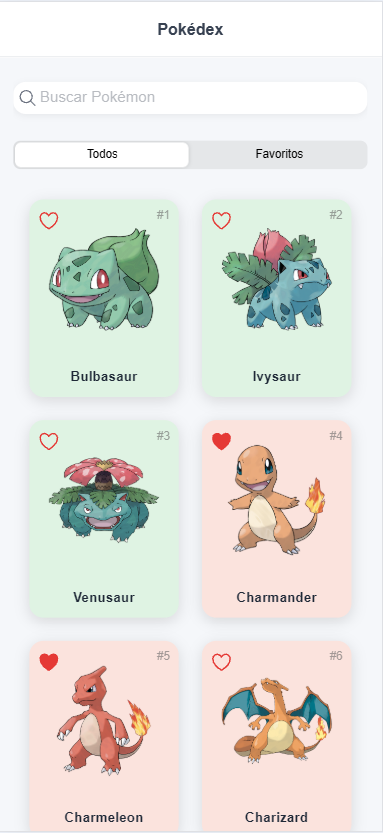
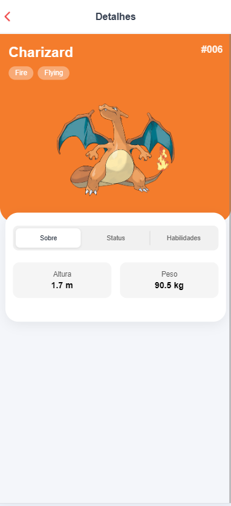
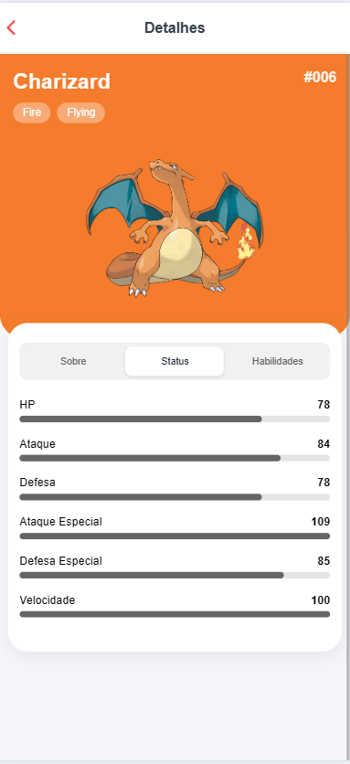
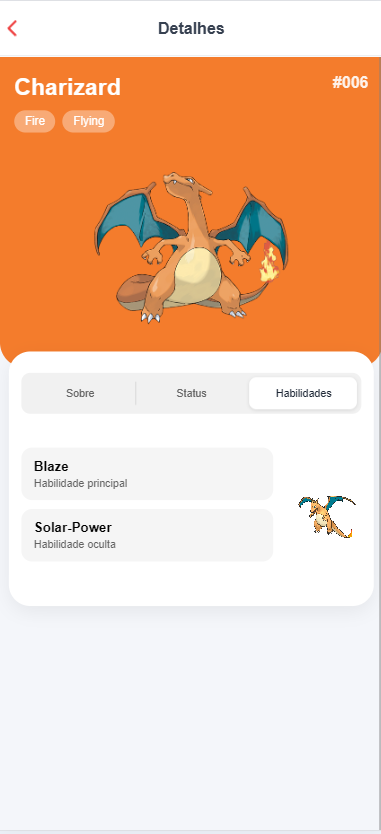
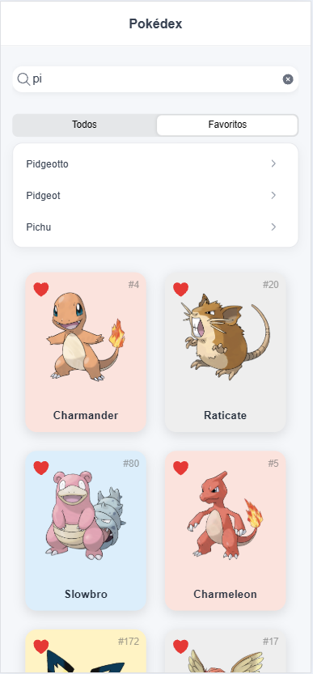

# Pokédex

Aplicação desenvolvida em Ionic com Angular para consumo da PokéAPI, permitindo listar, pesquisar, favoritar e visualizar detalhes dos Pokémon.

O projeto foi desenvolvido como parte de um desafio técnico, com foco em organização de código, componentização, responsividade e boas práticas de desenvolvimento.

## Funcionalidades

- Listagem de Pokémon com nome e imagem
- Paginação com carregamento incremental
- Busca por nome com sugestões
- Tela de detalhes
- Informações de tipo, altura, peso, status e habilidades
- Favoritos persistidos no `localStorage`
- Filtro para visualização de favoritos
- Envio de evento via webhook ao favoritar um Pokémon
- Interface responsiva
- Compatibilidade com diferentes orientações mobile
- Cores dinâmicas de acordo com o tipo principal do Pokémon

## Tecnologias

| Tecnologia | Versão |
|---|---|
| Angular | 20.3.2 |
| Ionic | 8.8.16 |
| TypeScript | 5.9.0 |
| Node.js | 24.17.0 |
| Capacitor | 8.5.0 |
| Vitest | 3.2.7 |

Também foram utilizados:

- RxJS
- Ionicons
- PokéAPI
- Official Artwork da PokéAPI
- Vercel Functions

## Organização do projeto

A aplicação foi organizada separando responsabilidades entre serviços, modelos, páginas e estilos compartilhados.

- `core/services`: comunicação com a PokéAPI e gerenciamento de favoritos.
- `features/pokemon`: modelos e tela de detalhes do domínio Pokémon.
- `home`: tela principal com listagem, busca, paginação e favoritos.
- `theme`: estilos reutilizáveis e paleta de cores dos tipos.
- `environments`: URLs e configurações por ambiente.

Essa organização evita concentrar responsabilidades em uma única camada e facilita a manutenção e evolução da aplicação.

## Abordagem

1. O projeto foi iniciado com uma estrutura simples e evoluído de forma incremental, mantendo commits relacionados a cada funcionalidade.
2. A comunicação com a PokéAPI foi centralizada em um serviço Angular utilizando injeção de dependência.
3. Os dados utilizados pela aplicação foram tipados com interfaces TypeScript.
4. A listagem principal utiliza paginação para carregar os Pokémon em grupos.
5. A busca utiliza uma lista leve de Pokémon para fornecer sugestões sem realizar uma requisição a cada caractere digitado.
6. Os favoritos são persistidos no `localStorage` e podem ser acessados independentemente da paginação.
7. As cores dos tipos dos Pokémon foram centralizadas no tema da aplicação para evitar duplicação de estilos.
8. Estilos reutilizáveis foram separados dos estilos específicos das páginas.
9. A interface foi adaptada para diferentes tamanhos de tela e orientações mobile.
10. A implementação priorizou legibilidade, baixo acoplamento e facilidade de manutenção.

## API

Os dados da aplicação são obtidos através da PokéAPI.

Principais recursos utilizados:

```text
GET /pokemon
GET /pokemon/{id}
```

## Webhook

A aplicação possui uma integração via webhook disparada ao favoritar um Pokémon.

O evento é enviado através de uma requisição `POST` para uma Vercel Function disponível no endpoint:

```text
/api/webhook
```

Exemplo de payload:

```json
{
  "event": "pokemon_favorited",
  "pokemon": {
    "id": 4,
    "name": "charmander"
  },
  "createdAt": "2026-08-30T02:22:26.185Z"
}
```

A função serverless recebe o evento e retorna uma confirmação da requisição.

Essa implementação foi utilizada para demonstrar uma integração orientada a eventos sem a necessidade de manter um servidor backend dedicado.

## Como executar

Clone o repositório:

```bash
git clone https://github.com/LeandroLaureanoD/pokedex.git
```

Acesse a pasta do projeto:

```bash
cd pokedex
```

Instale as dependências:

```bash
npm install
```

Execute a aplicação:

```bash
ionic serve
```

A aplicação ficará disponível no endereço informado pelo Ionic no terminal.

Para executar a aplicação localmente junto com a Vercel Function utilizada pelo webhook:

```bash
vercel dev
```

## Testes

Os testes unitários utilizam Vitest.

Atualmente, a suíte cobre:

- comunicação do `PokemonService` com a PokéAPI;
- listagem e consulta de Pokémon;
- inclusão e remoção de favoritos;
- prevenção de favoritos duplicados;
- navegação da tela principal para os detalhes;
- formatação de ID, altura, peso e status;
- criação dos principais componentes da aplicação;
- envio do webhook ao favoritar um Pokémon.

Para executar os testes em modo de observação:

```bash
npm test
```

Para executar uma única vez:

```bash
ng test --configuration ci
```

Resultado atual:

```text
Test Files  5 passed
Tests       18 passed
```

## Responsividade

A interface foi desenvolvida considerando dispositivos móveis e diferentes orientações de tela.

Foram realizados testes em:

- modo portrait;
- modo landscape;
- visualização Android;
- visualização iOS.

## Apresentação

### Tela principal e detalhes

<p align="center">
  
  
  
  
  
</p>

## Melhorias futuras

- ampliar a cobertura de testes unitários;
- adicionar cache para os detalhes dos Pokémon;
- adicionar filtros por tipo;
- aprimorar o tratamento de indisponibilidade da API.

## Autor

**Leandro Laureano Durães**  
Desenvolvedor Full Stack

GitHub: [LeandroLaureanoD](https://github.com/LeandroLaureanoD)